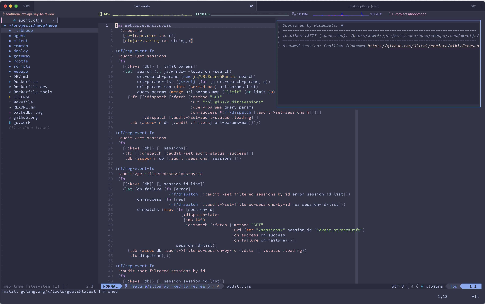

<h1 align="center"><b>(Not so simple) neovim & dotfiles setup</b></h1>

<p align="center">
    Clojure, Go, TypeScript|JavaScript (Deno & Node), Rust, Lua
    <br />
    <br />
    <a target="_blank" href="https://mat-m.com">Check my website</a>
    ·
    <a target="_blank" href="https://github.com/mtmr0x/dotfiles/blob/main/neovim/init.lua">See the init.lua neovim</a>
  </p>
</p>


## Overview

These dotfiles are dependant of the following steps. After following the next steps, you will get a
terminal client with zsh on Oh-My-Zsh framework and Spaceship theme and a powerful NVIM configuration.

## Prerequisites

**Clone this repository**

```sh
git clone git@github.com:mtmr0x/dotfiles.git
```

**Access this dotfiles folder:**

```sh
cd dotfiles/
```

**Move .zshrc file to your root**

```sh
cp .zshrc ~/.zshrc
```

**Install these external dependencies**

 - [Homebrew](https://brew.sh)
 - [Oh my Zsh](https://ohmyz.sh/#install)
 - [A powerline font](https://github.com/powerline/fonts) - You must set one of them as your terminal font for symbols and characters compatibility
 - [The silver searcher](https://github.com/ggreer/the_silver_searcher) - In order to give super powers to the nvim

## Neovim setup

**Install Neovim and its dependencies**

```sh
brew upgrade python
brew install python3
pip3 install neovim --user

# Install Neovim
brew install neovim

# Install The Silver Searcher
brew install the_silver_searcher

# Install FZF
brew install fzf

# install Node
brew install node

# Install Yarn
brew install yarn

```

Install Lazy for dependency management in neovim: [https://www.lazyvim.org/](https://www.lazyvim.org/)

Paste the neovim init file to your root:

```sh
# Create Neovim folder configs and paste the content inside
mkdir ~/.config
mkdir ~/.config/nvim
# move files to your root
cp neovim/init.vim ~/.config/nvim/init.vim
```

Access the init.vim file and make sure to update API Keys

**Restart your terminal session and you're done 🎉**

## iTerm2 themes:

Inside the `iterm-themes` folder has catppuccin themes for iTerm2. You can import them by going to iTerm2 > Preferences > Profiles > Colors > Color Presets > Import and selecting the theme you want.

## License

MIT License

Copyright 2024 - Matheus Marsiglio

Permission is hereby granted, free of charge, to any person obtaining a copy of this software and associated documentation files (the “Software”), to deal in the Software without restriction, including without limitation the rights to use, copy, modify, merge, publish, distribute, sublicense, and/or sell copies of the Software, and to permit persons to whom the Software is furnished to do so, subject to the following conditions:

The above copyright notice and this permission notice shall be included in all copies or substantial portions of the Software.

THE SOFTWARE IS PROVIDED “AS IS”, WITHOUT WARRANTY OF ANY KIND, EXPRESS OR IMPLIED, INCLUDING BUT NOT LIMITED TO THE WARRANTIES OF MERCHANTABILITY, FITNESS FOR A PARTICULAR PURPOSE AND NONINFRINGEMENT. IN NO EVENT SHALL THE AUTHORS OR COPYRIGHT HOLDERS BE LIABLE FOR ANY CLAIM, DAMAGES OR OTHER LIABILITY, WHETHER IN AN ACTION OF CONTRACT, TORT OR OTHERWISE, ARISING FROM, OUT OF OR IN CONNECTION WITH THE SOFTWARE OR THE USE OR OTHER DEALINGS IN THE SOFTWARE.

