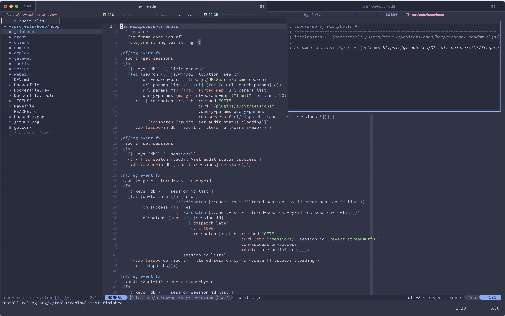

<h1 align="center"><b>(Not so simple) neovim & dotfiles setup</b></h1>

<p align="center">
    Clojure, Go, TypeScript|JavaScript (Deno & Node), Rust, Lua
    <br />
    <br />
    <a target="_blank" href="https://mat-m.com">Check my website</a>
    ·
    <a target="_blank" href="https://github.com/mtmr0x/dotfiles/blob/main/neovim/init.lua">See the init.lua neovim</a>
  </p>
</p>

[](https://github.com/mtmr0x/dotfiles/blob/main/screenshot-nvim-setup.png)

## Overview

These dotfiles rely on a minimal zsh setup — no frameworks, just a fast prompt via
Starship, autosuggestions, and syntax highlighting. After following the steps below,
you'll also get a powerful Neovim configuration.

## Prerequisites

**Clone this repository**

```bash
git clone git@github.com:mtmr0x/dotfiles.git
```

**Access this dotfiles folder:**

```bash
cd dotfiles/
```

**Move .zshrc file to your root**

```bash
cp .zshrc ~/.zshrc
```

**Install [Homebrew](https://brew.sh) if you haven't already**

```bash
/bin/bash -c "$(curl -fsSL https://raw.githubusercontent.com/Homebrew/install/HEAD/install.sh)"
```

## Shell setup (zsh + Starship)

**Install Starship prompt**

```bash
brew install starship
```

**Install autosuggestions and syntax highlighting**

```bash
brew install zsh-autosuggestions zsh-syntax-highlighting
```

**Apply the Tokyo Night preset**

```bash
starship preset tokyo-night -o ~/.config/starship.toml
```

**Add the following to your `~/.zshrc`** (already included if you copied the file above):

```bash
# Starship prompt
eval "$(starship init zsh)"

# Autosuggestions
source $(brew --prefix)/share/zsh-autosuggestions/zsh-autosuggestions.zsh

# Syntax highlighting (must be last)
source $(brew --prefix)/share/zsh-syntax-highlighting/zsh-syntax-highlighting.zsh
```

Restart your terminal and the prompt will be live.

## Neovim setup

**Install Neovim and its dependencies**

```bash
brew upgrade python
brew install python3
pip3 install neovim --user

# Install Neovim
brew install neovim

# Install The Silver Searcher
brew install the_silver_searcher

# Install FZF
brew install fzf

# Install Node
brew install node

# Install Yarn
brew install yarn
```

Install Lazy for dependency management in neovim: https://www.lazyvim.org/

Paste the neovim init file to your root:

```bash
mkdir -p ~/.config/nvim
cp neovim/init.lua ~/.config/nvim/init.lua
```

Access the init.lua file and make sure to update any API keys.

**Restart your terminal session and you're done 🎉**

## iTerm2 themes

Inside the `iterm-themes` folder you'll find Catppuccin themes for iTerm2.
Import them via iTerm2 → Preferences → Profiles → Colors → Color Presets → Import.

## License

MIT License

Copyright 2026 - Matheus Marsiglio
...
